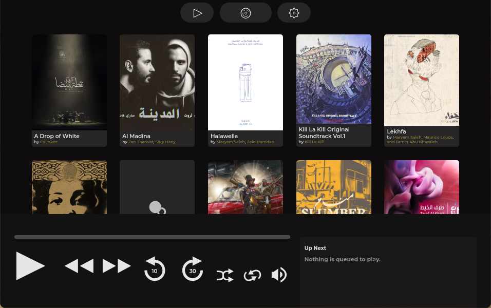

# Welcome to Dawayer

Dawayer was a audio player built with web technologies it lets you play local files and stream podcasts.

It was also supposed to be able to stream music from a streaming service, and have a feed page that gives you personalized playlists, statistics about your listening habits and notifies you when your favorite artist published a new track or a new podcast episode, but the app was cancelled before any of those two features made it through.

#### Features
- Play podcasts.
- Play local audio files.
- <strike>Gives you personalized playlists and statistics</strike>.
- All the other modern audio player features like saving your seek-time and queue between sessions and etc...
- <strike>MPRIS Player support for linux</strike>.
- Dark Mode.

<!--  -->

<!--  -->

<!-- # Download

**We need people to test macOS version before we can release it.**

- **Linux:**
[AUR](https://aur.archlinux.org/packages/dawayer) |
[deb](https://github.com/HP-J/Dawayer/releases/download/70879867/Dawayer.deb) |
[tar.xz](https://github.com/HP-J/Dawayer/releases/download/70879867/Dawayer.tar.xz)
- **Windows:**
[Setup](https://github.com/HP-J/Dawayer/releases/download/70879867/Dawayer-Setup.exe) -->

# Build
Since te app was canceled the best way to get it is to build it yourself (some fixes never made it to any full release).

- `git clone https://github.com/hpj/Dawayer && cd Dawayer`
- `npm install && npm run build`
- `npx electron ./build/main/main.js`

# Licenses
This project is licensed under the [MIT](https://github.com/HP-J/Dawayer/blob/development/LICENSE) License.  
All icons inside the [icons](https://github.com/HP-J/Dawayer/tree/development/assets) folder are made by us and are licensed under [CC BY 4.0](https://creativecommons.org/licenses/by/4.0/).

# Acknowledgments
the Queue design is inspired by [Phonograph](https://play.google.com/store/apps/details?id=com.kabouzeid.gramophone) created by [Karim Abou Zeid](https://kabouzeid.com/).  
the Album design is inspired by this [dribble](https://dribbble.com/shots/4579038-Foodiefit-Interaction-studio-included) created by [Kreativa Studio](https://dribbble.com/KreativaStudio/).  
