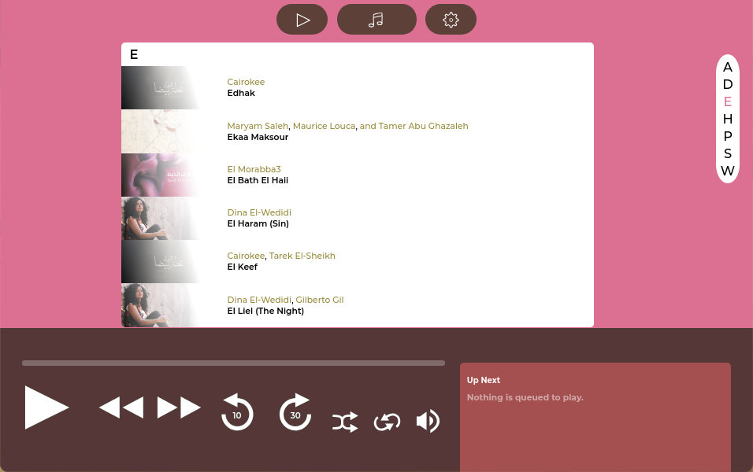

# Welcome to Dawayer
#### An ordinary audio player built with web technologies

#### Features
- Play local audio files
- Play podcasts
- MPRIS Player support for linux.
- All the other modern audio player features like saving your seek-time and queue between sessions and etc...
- TBA

#### Screenshots

# Download
#### Dawayer is a new software it may be buggy

- **Linux:**
[AUR](https://aur.archlinux.org/packages/dawayer) |
[deb](https://gitlab.com/hpj/Dawayer/-/jobs/artifacts/release/raw/public/Dawayer.deb?job=build) |
[tar.xz](https://gitlab.com/hpj/Dawayer/-/jobs/artifacts/release/raw/public/Dawayer.tar.xz?job=build)

# Licenses
This project is licensed under the [MIT](https://gitlab.com/hpj/Dawayer/blob/development/LICENSE) License.  
All icons inside the [icons](https://gitlab.com/hpj/Dawayer/tree/development/res) folder are made by us and are licensed under [CC BY 4.0](https://creativecommons.org/licenses/by/4.0/).

# Acknowledgments
the Queue design is inspired by [Phonograph](https://play.google.com/store/apps/details?id=com.kabouzeid.gramophone) created by [Karim Abou Zeid](https://kabouzeid.com/).  
the Album design is inspired by this [dribble](https://dribbble.com/shots/4579038-Foodiefit-Interaction-studio-included) created by [Kreativa Studio](https://dribbble.com/KreativaStudio).  